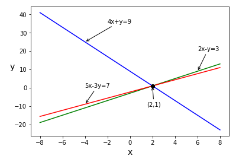
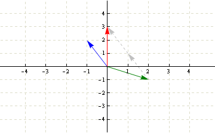

# Introduction To Linear Algebra

# Big Picture

In Linear Algebra, we have two broad kinds of problems

1. $Ax = y$ where $A$ represents some form of matrix
2. $Ax = \lambda y$ where $A$ represents some form of matrix and $\lambda$ some constant

We will be required to implement some basic functions in R for this course and are not allowed to use the in-built operators for vector addition, dot product and others.

# General Paradigms

## Row Picture

When looking at the row picture, we are sketch out all combinations of our variables which will give us a desired result.

# Big Picture

In Linear Algebra, we have two broad kinds of problems

1. $Ax = y$ where $A$ represents some form of matrix
2. $Ax = \lambda y$ where $A$ represents some form of matrix and $\lambda$ some constant

We will be required to implement some basic functions in R for this course and are not allowed to use the in-built operators for vector addition, dot product and others.

# General Paradigms

## Row Picture

The row picture is most naturally seen when we are young when we are given a system of equations such as

$$
x + 2y + 3z\\
2x + 3y + z\\
$$

We observe here that we require three equations for our three unknowns. This is because each equation represents a plane in $R^{3}$ and we need three planes in order to find a point of intersection between each plane.

When looking at the row picture, we are sketch out all combinations of our variables which will give us a desired result.

As seen above, we either have a unique solution (Where $4x+y=9$ and $2x-y=3$ intersect) or we have no solutions ( if we had $4x+y=9$ and perhaps $8x+2y=18$).

## Column Picture

The column picture asks us to determine if we can find a vector for which we can obtain a desired vector.

As seen above, we either have a unique solution (Where $4x+y=9$ and $2x-y=3$ intersect) or we have no solutions ( if we had $4x+y=9$ and perhaps $8x+2y=18$).
