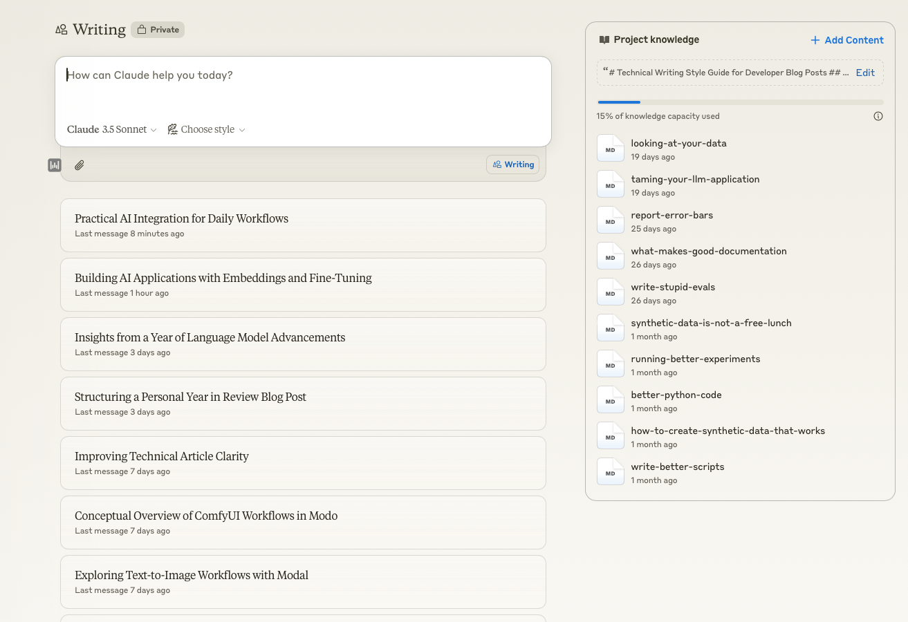
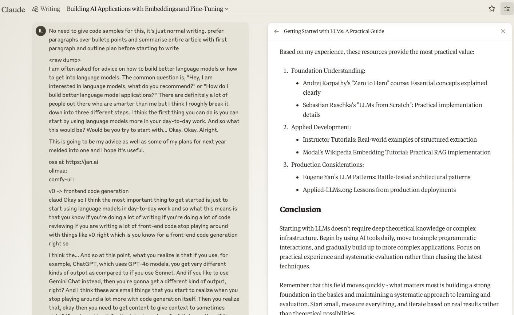
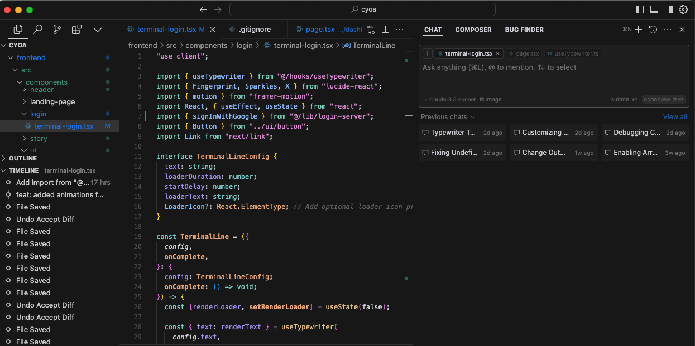

# Getting Started with Language Models in 2025

After a year of building AI applications and contributing to projects like Instructor, I've found that getting started with language models is simpler than most people think. You don't need a deep learning background or months of preparation - just a practical approach to learning and building.

Here are three effective ways to get started (and you can pursue all of them at once):

1. **Daily Usage**: Put Claude, ChatGPT, or other LLMs to work in your daily tasks. Use them for debugging, code reviews, planning - anything. This gives you immediate value while building intuition for what these models can and can't do well.

2. **Focusing on Implementation**: Start with Instructor and basic APIs. Build something simple that solves a real problem, even if it's just a classifier or text analyzer. The goal is getting hands-on experience with development patterns that actually work in production.

3. **Understand the Tech**: Write basic evaluations for your specific use cases. Generate synthetic data to test edge cases. Read papers that explain the behaviors you're seeing in practice. This deeper understanding makes you better at both using and building with these tools.

You should and will be able to do all of these at once. Remember that the goal isn't expertise but to discover which aspect of the space you're most interested in.

There's a tremendous amount of possible directions to work on - dataset curation, model architecture, hardware optimisation, etc and other exiciting directions such as [Post Transformer Architectures](https://www.latent.space/p/2024-post-transformers) and [Multimodal Models](https://magazine.sebastianraschka.com/p/understanding-multimodal-llms) that are happening all at the same time.

<!-- more -->

## Daily Usage

!!! note "Key Takeaways From This Section"

    If you're just getting started, focus on using hosted platforms like Claude, ChatGPT, and V0 to build intuition. Try using speech-to-text tools to interact more naturally with LLMs - this significantly improves the quality of outputs.

    Start applying LLMs to specific workflows: use them to transform rough ideas into structured content, debug and refactor code with tools like Cursor, or rapidly prototype interfaces with V0. The most valuable lessons about model limitations come from hands-on experience rather than theory.

The best way to learn language models isn't by studying them - it's by actively using them in your daily work to discover their strengths, weaknesses, and practical applications. I recommend starting with simple hosted platforms such as Claude, ChatGPT or V0.

> To get started, I recommend using a speech to text model to help you express thoughts and requests much more verbosely and naturally than typing would. This genuinely helps you get more out of the language models. I highly recommend using [Wispr Flow](https://www.flowvoice.ai/?referral=IVAN18) for transcribing audio.

My main use cases are for writing and coding and I mostly use the hosted platforms for these - mainly Claude Projects, Cursor and V0. Let's see how I use these tools in my daily workflows. By the end of this, you'll have a better idea of what you can use these models for.

### Writing

I use Claude to transform raw ideas into structured content. My process is incredibly simple - I just feed it a transcript of my thoughts and it'll generate a blog post outline and sketch.

You can see the full process in this snapshot below where I've fed in a transcript of my thoughts and it's generated a blog post outline and sketch.

This is a huge time saver and sometimes, claude zero-shots the perfect article that I want to write.

Better yet, by providing examples of my writing style and my content, the content that's generated becomes more consistent over time with how I write and think about language models itself. It's also significantly easier to start linking/writing about content that I've written about before since it's provided to the model in the prompt.

### Coding

[Cursor](https://www.cursor.com/) is a great way to get started with language models for coding. I mainly use it for writing code and debugging. What's great about it is that it's built on top of VSCode so all I had to do was to just install it, sync my VSCode settings and I was ready to go.

From the above, you can see a few things

1. The current file is automatically included in the context when you chat with the model itself. This makes it easy to ask questions/debug issues as they pop up
2. You also get the ability to rewrite chunks of your code - I like to use this to refactor code and improve readability. It's especially useful for doing things like refactoring complex functions, adding types or just basic logging
3. They also have a composer function which is a way to generate multiple files at once based off a request you have (Eg. Generate a new component that calls this specific api-route )

I really like the fact that syncing documentation from libraries is built in with a simple command so that it can make up for outdated knowledge cut-offs.

### Frontend Work

I use language models extensively for coding and writing. For instance, the following UI that I was prototyping was generated almost entirely by a language model using [V0](https://v0.dev).

It's crazy because just 3 years ago, this would have cost a significant amount of money and time to build.

But now with $20, I can generate prototypes like this in minutes - refining my ideas and iterating on them and getting a whole full fledged UI in minutes. (I wrote a [quick thread here on some of my takeaways from using V0](https://x.com/ivanleomk/status/1873566422162719182))

But at its core, these platforms provide a way to get started with language models fast. These models are incredibly powerful and they know so much about the world. By using these hosted platforms, it becomes easy to reference past conversations, iterate on prompts and build up small automations that help you save time and generate more outputs.

More importantly, these workflows teach you that language models, despite their impressive capabilities aren't magic.

They have specific failure modes and blind spots that you can only learn to recognize and work around through consistent interaction. By doing so, you'll also naturally discover techniques like role-based prompting, few-shot learning, and how to effectively structure your requests.

## Focusing on Implementation

!!! note "Key Takeaways From This Section"

    Start your implementation journey with structured outputs using the OpenAI API and Instructor. Keep your focus on measurable improvements - write simple evaluations before complex ones, test different response models and prompt variations systematically, and compare performance across different providers.

    Don't jump straight to subjective metrics; begin with objective ones that are easy to measure and understand. When implementing RAG, prioritize the quality of retrieved content, ensure effective integration with your existing system, and systematically evaluate improvements over time.

The next step of understanding comes from hands-on experience. You'll find that with the raw API, you'll have much more flexibility and control over what the models can do. This also means that there's a significantly larger surface area of things that might go wrong. I would recommend starting with things in the following order

1. Working with the OpenAI API and getting used to Structured Outputs ( and when you shouldn't use them )
2. Writing Evaluations
3. Adding in RAG to your application

If at any point, you're confused about the terminology, I'd recommend reading through this [glossary of terms](https://exec-edu.parlance-labs.com/05_asset_glossary.html) by Hamel Hussain for a quick reference.

### Using Structured Outputs

The OpenAI API provides an excellent starting point for hands-on experience. I recommend starting with the [instructor tutorials](https://python.useinstructor.com/tutorials/1-introduction/). These tutorials cover essential concepts like basic API interactions, implementing guardrails, working with structured outputs, and running your first fine-tuning job. You can complete the full tutorial series in just a few hours, giving you practical experience with the fundamental building blocks of LLM applications.

Once you're comfortable with basic API usage, expand your toolkit by trying different models and providers. Tools like Instructor make this exploration straightforward - you can switch between providers like Google and OpenAI with just a few lines of code. This flexibility lets you compare different models without having to rewrite your entire application.

### Writing Evaluations

Once you start working with model APIs directly, a crucial question emerges: how do we measure model performance? The answer lies in writing evaluations, and they're simpler to start with than you might think.

#### Getting Started with Evaluations

Small changes can have big impacts in LLM applications. For instance, [response models make a huge difference](https://python.useinstructor.com/blog/2024/09/26/bad-schemas-could-break-your-llm-structured-outputs/), especially when using techniques like Chain of Thought prompting. The key is starting simple - [write stupid evals first](../posts/write-stupid-evals.md) and [focus on keeping them simple](../posts/writing-extraction-evals.md) where possible.

I wrote up a more concrete guide to [running evaluations using the GSM8k as an example using braintrust](./braintrust-from-scratch.md) if you'd like to get started. You don't need to use braintrust, a simple python list, pandas and a few lines of code can get you started.

#### Types of Evaluations

Evaluations are more than just a way to ensure language models are working as expected. They help us systematically measure the impact of adding examples to prompts, response models on the generated responses of the modesl itself. This helps you to compare the impact of different knobs that you've been playing with such as the response model, temperature, prompt examples and even the model itself.

These tend to be in two main forms as seen below

1. Objective : Clear metrics like Accuracy, Recall, MRR etc that are easy to test and iterate on. They don't however give a lot of granular feedback
2. Subjective : These are more qualitative metrics that give you a gut sense for how well a model is performing. They're great for getting a sense for how well a model is performing but they're harder to iterate on and test.

Start with objective metrics since they're easier to implement and automate. However, don't forget to regularly examine your data manually - there's no substitute for developing good intuition about model behavior.

Ideally you want to do both but focus heavily on objective evaluations at the start since they're much easier to run early on. You should always be [looking at your data](./looking-at-your-data.md) manually too to get a gut sense for how your model is performing against different prompts.

#### Building Better Systems

Different models excel at different tasks - Claude for writing and analysis, Gemini for handling large contexts, and OpenAI for reliable API access. As you develop more complex applications, robust evaluation becomes critical. For deeper insights, I recommend Hamel Hussain's guides on [writing evaluations](https://hamel.dev/blog/posts/evals/) and handling [adversarial scenarios](https://hamel.dev/blog/posts/drift/) which provide practical frameworks for measuring and improving model performance.

### RAG

Now that you've been playing with language models for a while, you'll start to realise that sometimes they reference outdated information. That's where Retrieval Augmented Generation (RAG) comes in useful. Since models are only working with knowledge from their training data, we can work around this by injecting in relevant knowledge into the prompt for them to work with. This helps them to reference current information and improve their performance.

This is an entire whole blog post on it's own and so I recommend checking out the following guides

- [RAG is more than vector search](https://www.timescale.com/blog/rag-is-more-than-just-vector-search)
- [Tool Retrieval and RAG](https://jxnl.co/writing/2024/08/21/trade-off-tool-selection/)
- [Systematically Improving your RAG application](https://jxnl.co/writing/2024/11/18/decomposing-rag-systems-to-identify-bottlenecks/)
- [Data Flywheels for LLM Applications](https://www.sh-reya.com/blog/ai-engineering-flywheel/)
- [Your RAG Application needs Evals](https://hamel.dev/blog/posts/evals/)
- [Patterns for Building LLM Applications](https://eugeneyan.com/writing/llm-patterns/)
- [What we learnt from a year of building LLM applications](https://applied-llms.org)

## Understanding the Tech

!!! note "Key Takeaways From This Section"

    Take an iterative approach to building technical understanding. Begin with foundational concepts like attention and embeddings before tackling more complex architectures. Don't hesitate to use AI assistants to break down difficult concepts into simpler terms.

    Study open source implementations to understand practical details, learn about token generation and model behavior, and familiarize yourself with deployment basics. While staying current with research is valuable, make sure you have a solid grasp of the fundamentals first - they'll serve as building blocks for understanding more advanced concepts.

After building applications with hosted APIs, you'll naturally want to peek under the hood. This means transitioning from treating language models as black boxes to running and potentially modifying them yourself through open source implementations. This transition requires a different skillset. Rather than simply making API calls, you'll need to:

- Manage model deployments and infrastructure
- Understand token generation and model architecture
- Debug model behavior and performance issues

### A Gradual Learning Approach

One thing I've learned: you won't grasp everything immediately, and that's perfectly fine. I recommend taking multiple passes through the material, each time focusing on different aspects. Start with high-level concepts and gradually dive deeper.

When exploring theoretical concepts, I've found three key principles helpful:

- **Understanding Builds Gradually** : Don't try to understand everything at once. Start with core concepts like attention and embeddings, then build up to more complex ideas. I often use AI assistants like Claude to break down difficult concepts into simpler analogies.

- **Start with Clear Explanations** : The fundamentals haven't changed much since the original transformer paper. [Andrej Karpathy's "Zero to Hero" course](https://karpathy.ai/zero-to-hero.html) builds intuition from the ground up, taking you from simple n-grams to GPT-2 style architectures. I liked [Lee Robinson's introduction to AI here](https://leerob.com/n/ai) and am currently working through [Rasbt's LLMs from scratch](https://github.com/rasbt/LLMs-from-scratch)

- **Learn From Implementation** : Reading code teaches you things papers can't. Resources like [Naklecha's Llama 3 implementation](https://github.com/naklecha/llama3-from-scratch), [The Illustrated Transformer](https://jalammar.github.io/illustrated-transformer/), and [Umar Jamil's tutorials](https://www.youtube.com/@umarjamilai) show how theoretical concepts translate to working code.

### Exploring Current Research

Once you're comfortable with the basics, you can explore cutting-edge research through collections like [Latent Space 2025 Papers](https://www.latent.space/p/2025-papers). These papers cover breakthroughs in synthetic data generation, multi-modal understanding, and architectural innovations. Don't worry if some sections seem impenetrable at first - focus on understanding the high-level ideas and gradually dig deeper into the technical details that interest you most.

### Why It Matters

This progression from APIs to model internals isn't just academic - it directly improves your ability to build better systems. Understanding concepts like attention mechanisms and positional embeddings helps you make more informed decisions about model selection, fine-tuning strategies, and system architecture.

Remember: The goal isn't to understand everything at once. Focus on building a solid foundation and gradually expanding your knowledge. Use AI assistants to help clarify complex concepts, and don't hesitate to revisit topics multiple times. Each pass will deepen your understanding and reveal new insights.

As language models evolve with features like multi-modal understanding and improved reasoning capabilities, this foundational knowledge becomes increasingly valuable. You'll be better equipped to evaluate new models and architectures as they emerge, even if you don't understand every technical detail at first.

## Conclusion

Getting started with language models is a journey that can begin today. Whether you're using Claude to improve your writing, building applications with Instructor, or diving into model architectures, each path offers valuable insights that complement the others.

Most importantly, you'll develop the intuition and experience needed to build effective AI applications, regardless of how the technology evolves.

The best time to start is now - pick a small project, use the tools available, and begin building. The understanding you gain through hands-on experience will be invaluable as you progress to more complex applications and deeper technical challenges.
